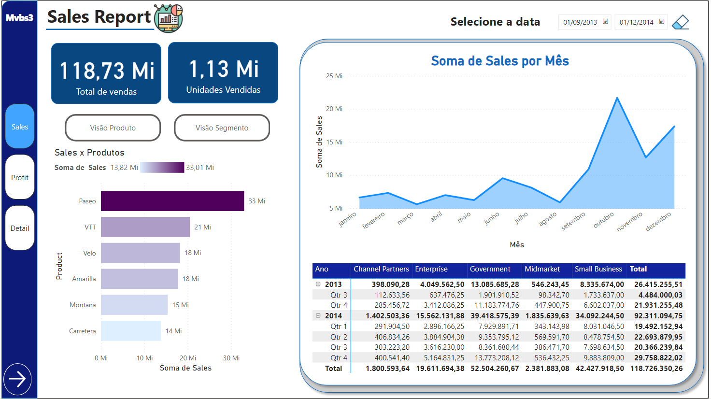
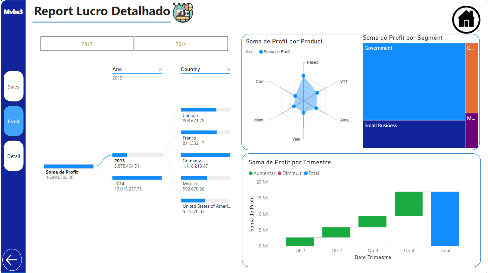
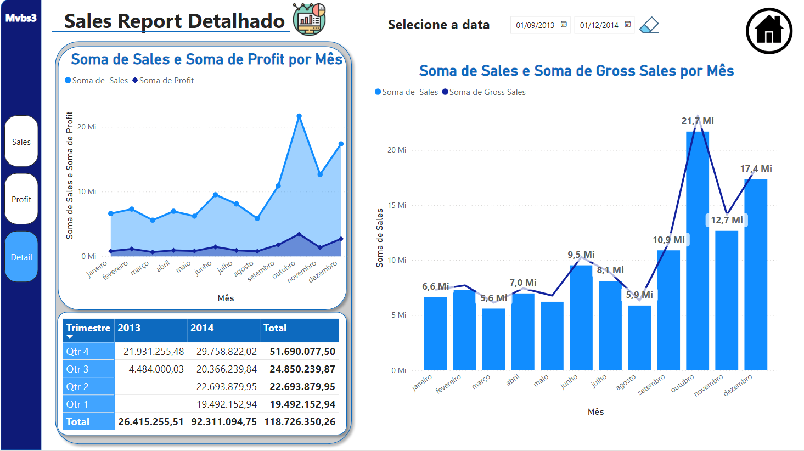

# relatorio_estilizado_powerBI

Este repositorio foi criado com o intuito de melhorar o relatório feito no repositório:
Utilizando as técnicas de User Experience.
As melhorias foram feitas com aideia de se tornar mais agradável ao olho, mais personalizavel e de mais facil de entendimento e navegação.

Existem 3 páginas atualmente desse relatório e cada uma tem seu propósito definido, sendo elas:

## O Sales report:

## O Profit report:

## O detalhamento do Sales report:

